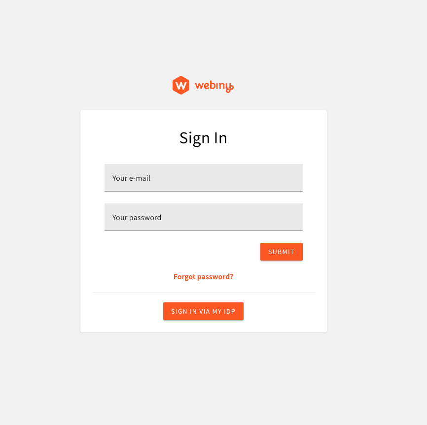

## Amazon Cognito Federation with Auth0

Built on the back of the [Cognito Federation - Cognito With OIDC IdPs](https://www.webiny.com/docs/enterprise/cognito-federation#cognito-with-oidc-id-ps) article, this extension allows users to use Auth0 as an additional identity provider with Amazon Cognito user pool. In other words, besides logging in by using the default Amazon Cognito user pool, users can now also log in by using their Auth0 account. 



## Setup

Once downloaded, this extension does involve a couple of manual steps to set up. Without these steps, the extension will not work.

In the `extensions/cognitoFederationWithA0/src` directory, you'll find three files:

1. `core.ts`
2. `api.ts`
3. `admin.tsx`

Let's go through each of them and see what manual steps are required.

### `core.ts`

The `core.ts` file exports a single `configureAdminCognitoFederation` function. This function is used to configure the Amazon Cognito user pool (that comes with every Webiny project) with Auth0 as an additional identity provider.

In order for it to work, for starters, the function must be imported and called in the `apps/core/webiny.application.ts` file:

```ts
import { createCoreApp } from "@webiny/serverless-cms-aws";
import { configureAdminCognitoFederation } from "cognito-federation-with-a0/src/core";

export default createCoreApp({
    pulumiResourceNamePrefix: "wby-",
    pulumi: app => {
        configureAdminCognitoFederation(app);
    }
});
```

Once that's in place, the next step would be to define three environment variables via your `.env` file:

```dotenv
WEBINY_CORE_AUTH0_CLIENT_ID=xxx
WEBINY_CORE_AUTH0_CLIENT_SECRET=xxx
WEBINY_CORE_AUTH0_OIDC_ISSUER=https://dev-xxx.us.auth0.com
WEBINY_CORE_COGNITO_USER_POOL_DOMAIN=my-webiny-admin-cognito-user-pool-domain
```

> You can see these environment variables being used in the `configureAdminCognitoFederation` function.

Finally, once all of these steps are done, you can run the following command to deploy the changes:

```bash
yarn webiny deploy core --env dev
```

### `api.ts`

The `api.ts` file exports two functions: `cognitoAuthentication` and `createSecurityGraphQL`. Essentially, these functions ensure that Webiny can authenticate users by using both the Amazon Cognito user pool and Auth0.

In order for it to work, the functions must be imported and called in the `apps/api/graphql/src/security.ts` file. Note that upon doing that, we'll have to do two things:

1. remove old imports of `cognitoAuthentication` and `createSecurityGraphQL` functions
2. replace the old `cognitoAuthentication` call with the new one

So, for starters, we import the functions:

```ts
import { createSecurityGraphQL, cognitoAuthentication } from "cognito-federation-with-a0/src/api";
```

Then, replace the old `cognitoAuthentication` call with the new one. So, instead of this:

```ts
/**
 * Cognito authentication plugin.
 * This plugin will verify the JWT token against the provided User Pool.
 */
cognitoAuthentication({
    region: String(process.env.COGNITO_REGION),
    userPoolId: String(process.env.COGNITO_USER_POOL_ID),
    identityType: "admin"
})
```

We now simply have this:

```ts
cognitoAuthentication()
```

Finally, once all of these steps are done, you can run the following command to deploy the changes:

```bash
yarn webiny deploy api --env dev
```

[work in progress]
- make sure to add `"cognito-federation-with-a0: "1.0.0"` to the `dependencies` in the `apps/api/graphql/package.json`

### `admin.tsx`

[work in progress]

Just import the `cognitoConfig` function in `apps/admin/src/App.tsx`:

```tsx
import React from "react";
import { Admin } from "@webiny/app-serverless-cms";
import { Cognito } from "@webiny/app-admin-users-cognito";
import { Extensions } from "./Extensions";

import "./App.scss";

import { cognitoConfig } from "cognito-federation-with-a0/src/admin";

export const App = () => {
    return (
        <Admin>
            <Cognito config={cognitoConfig} />
            <Extensions />
        </Admin>
    );
};
```
- make sure to add `"cognito-federation-with-a0: "1.0.0"` to the `dependencies` in the `apps/admin/package.json`


#### `apps/admin/webiny.config.ts
[work in progress]

This must aslo be added to the `apps/admin/webiny.config.ts` file:
```ts
import {
    createAdminAppConfig,
    configureAdminCognitoUserPoolDomain
} from "@webiny/serverless-cms-aws";

export default createAdminAppConfig(modifier => {
    configureAdminCognitoUserPoolDomain(modifier);
});
```